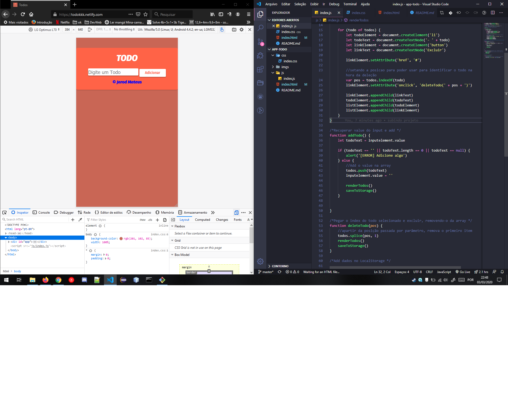
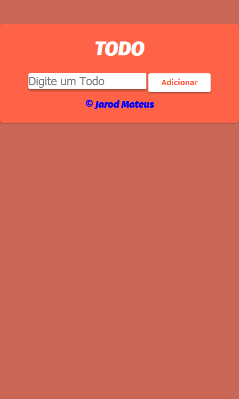
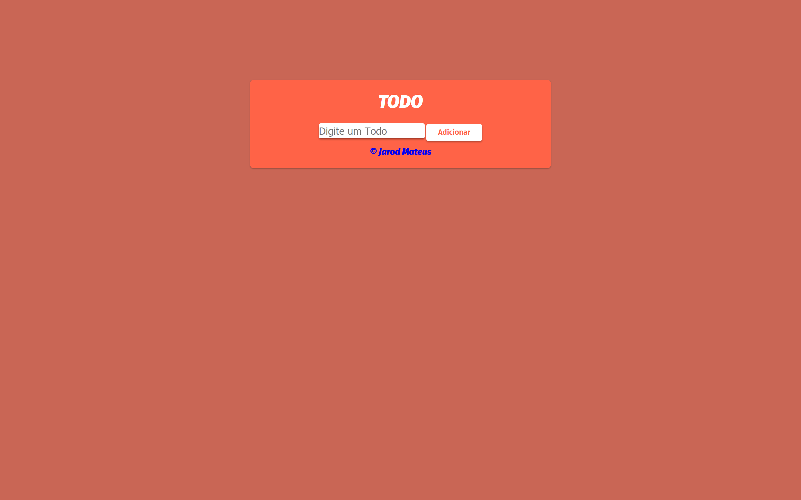

# App de TO DO (Minha Lista) desenvolvido com html, css e javascript

### O app é simples, explicarei brevemente a *lógica* abaixo:

* Crio o html básico
* No Js inicializo as variaveis que irão receber dados, no caso, o campo *input*
* Percorro por um vetor e, a cada passagem desse vetor, crio elementos *a* e *li* com o *texto* que recebo do *input*
* OBS: Devo criar uma função para adicionar os itens, que no caso, pegará o valor do *input* e guardarei na *array*, em seguida chamo a função que adiciona esses dados no html, que é o caso da função acima.
* Na mesma função que adiciono os dados, coloco como *atributo* o *index* de cada valor da *array* de dados a serem preenchidos
* Na função de deleção, recebo como *parametro* a *posição* do *index* que quero apagar, e com um ```todos.splice(pos, 1)``` removo o item. Logo em seguida chamo novamente a função para listar os todos para o usuário.

### segue abaixo alguns prints






